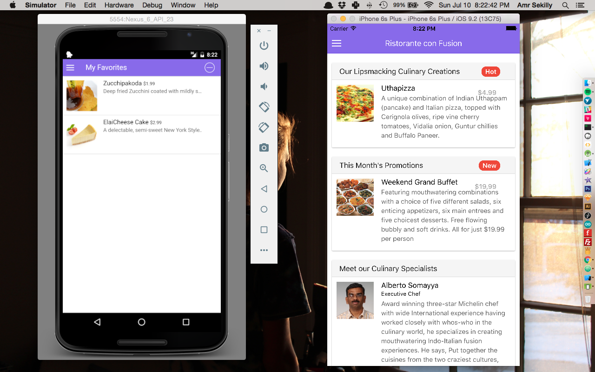

# Intro

This repository contains my work during the MOOC [Multiplatform Mobile App Development with Web Technologies](https://www.coursera.org/learn/hybrid-mobile-development) as part of the [Full stack web development specialization](https://www.coursera.org/specializations/full-stack).

# Repository contents
- conFusion:  contains the old AngularJS app that we have created in the previous MOOC.
- ionic/Confusion: contains the source code of the current Ionic/Cordova app we are building in this MOOC, in other words it's the mobile app version of the ConFusion app developed in the last MOOC.
- json-server: Is a dummy server that I'm using to serve a JSON file that I'm querying on my App.

# [Syllabus](https://www.coursera.org/learn/hybrid-mobile-development#syllabus)
- Hybrid Mobile App Development Frameworks: An Introduction.
- More Ionic CSS and JavaScript.
- Deploying your App.
- Accessing Native Capabilities of Devices: Cordova and ngCordova.
